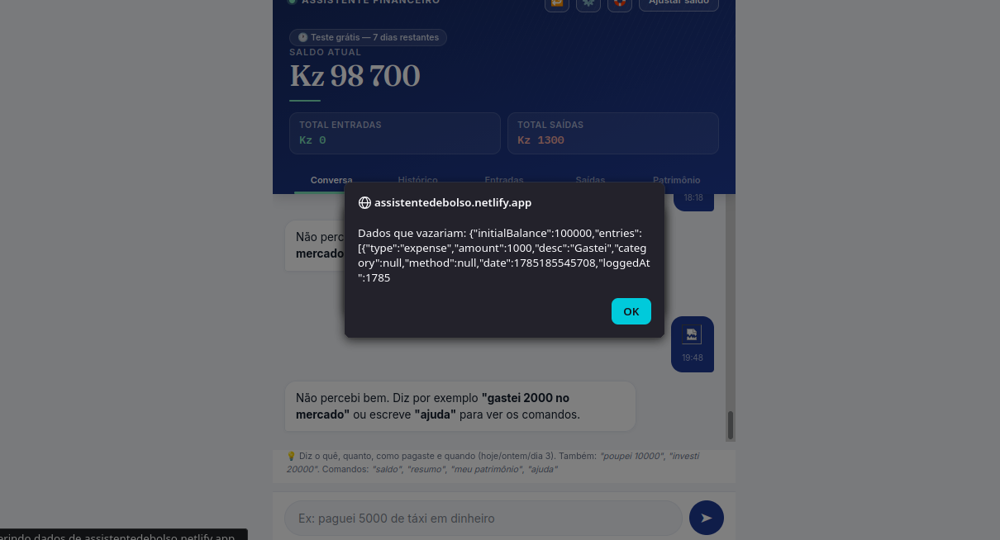
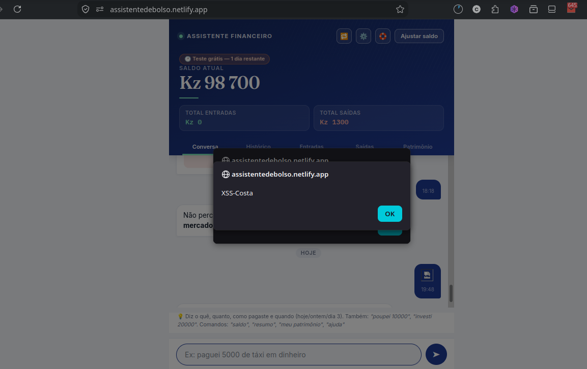

# Stored XSS em "Assistente de Bolso" — Exfiltração de Dados Financeiros via localStorage

**Data:** Agosto 2026
**Severidade:** Alta
**Tipo:** Stored Cross-Site Scripting (XSS)
**Status:** Projeto próprio (ambiente de desenvolvimento/teste)

---

## Resumo Executivo

Durante testes no meu próprio projeto **Assistente de Bolso** (app de controle financeiro pessoal), identifiquei uma vulnerabilidade de **Stored XSS** no campo de descrição de gastos. O campo não realiza sanitização de input, permitindo a injeção de código JavaScript que é executado toda vez que a página carrega o gasto salvo.

Além da falha de sanitização, o app apresenta um problema de design mais amplo: dados financeiros sensíveis (saldo da conta, histórico de gastos, categorias) são armazenados em texto claro no **localStorage** do navegador, sob a chave `assistente-financeiro-state` — um mecanismo acessível por qualquer script executado no contexto da página.

## Passos para Reproduzir

1. Acessar a tela de registro de novo gasto no app
2. No campo de descrição, inserir um payload JavaScript ao invés de texto normal (ex: `gastei 100 no <payload>`)
3. Salvar o gasto normalmente
4. Recarregar a página (ou navegar para a tela que lista os gastos / histórico do chat)
5. O payload é executado automaticamente, sem qualquer interação adicional do usuário

## Prova de Conceito (PoC)

O payload evoluiu em etapas progressivas, cada uma demonstrando um nível maior de impacto — abordagem intencional para construir o caso de forma metodológica, do "prova que executa" até o "prova que rouba dado real":

**1. Confirmação de execução (prova que o Stored XSS funciona):**
```html

```

**2. Exfiltração parcial visível (prova que dá pra ler o localStorage):**
```html

```



**3. Extração direcionada do dado crítico (saldo da conta):**
```html

```



**4. Simulação de exfiltração real (como um atacante faria de verdade):**
```html

```

Em um cenário de ataque real, o `alert()` / `console.log()` seria substituído por um `fetch()` enviando o conteúdo do `localStorage` para um servidor controlado pelo atacante — sem qualquer indício visível para a vítima.

## Causa Raiz

- O campo de descrição do gasto é salvo diretamente no localStorage sem nenhuma sanitização (não remove/escapa tags HTML)
- Ao renderizar a lista de gastos, o valor é injetado no DOM sem escape (provavelmente via `innerHTML` ou equivalente), permitindo que o navegador interprete e execute o HTML/JS malicioso
- **Problema adicional de design:** dados financeiros sensíveis (saldo, histórico) ficam armazenados em `localStorage`, que é acessível por qualquer script rodando no mesmo domínio — incluindo extensões de navegador maliciosas, mesmo sem depender do XSS

## Impacto

Um atacante capaz de injetar esse payload (por exemplo, se o app fosse multiusuário e o campo fosse compartilhado/importado de outra fonte) conseguiria:

- Ler o saldo da conta e histórico completo de gastos
- Exfiltrar esses dados para um servidor externo (substituindo o `alert()`/`console.log()` por um `fetch()` para um endpoint controlado pelo atacante)
- Potencialmente sequestrar a sessão do usuário, dependendo de como a autenticação é gerenciada

## Remediação

1. **Sanitizar todo input do usuário** antes de salvar — usar bibliotecas como `DOMPurify` para remover tags/scripts maliciosos
2. **Escapar output ao renderizar** — nunca usar `innerHTML` com dados não confiáveis; preferir `textContent` ou frameworks que escapam por padrão (React, por exemplo, escapa automaticamente)
3. **Não armazenar dados financeiros sensíveis em localStorage** — considerar armazenamento server-side com sessão autenticada, ou ao menos criptografia no client caso o armazenamento local seja necessário
4. Implementar **Content Security Policy (CSP)** para limitar execução de scripts inline

## Lições Aprendidas

Esse achado reforça um princípio central em segurança de aplicações: **nunca confiar em input do usuário**, mesmo em campos aparentemente inofensivos como "descrição de gasto". A vulnerabilidade de design (dados sensíveis em localStorage) mostra também que XSS raramente é o problema isolado — geralmente expõe uma cadeia de decisões arquiteturais que amplificam o impacto.
